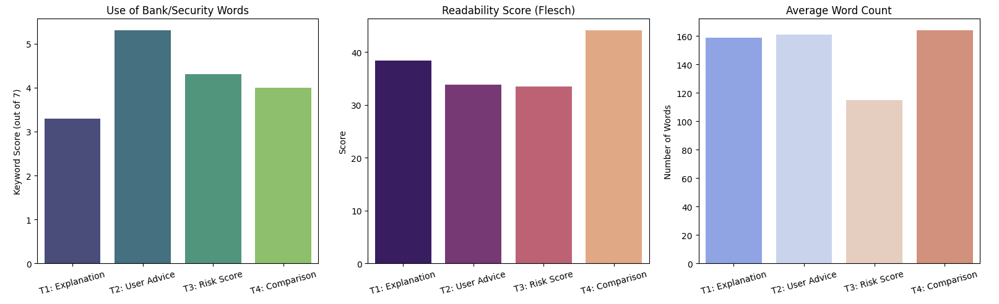
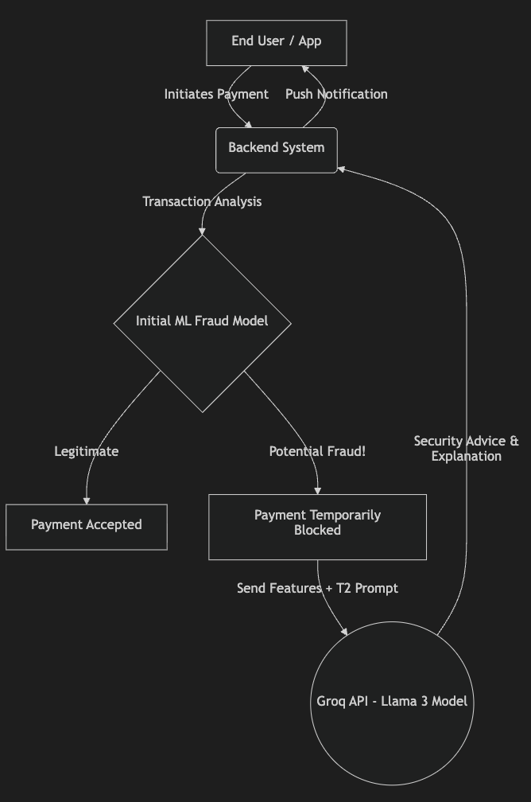

# Generative AI Prompt Design Rationale
**SWE485 - Machine Learning Project**

This document outlines the systematic design, evaluation, and integration plan for the Generative AI component of our fraud detection system. 

---

## 1. Analysis: Qualitative & Quantitative Results

To ensure our AI provides the best possible assistance to users during a potential fraud incident, we engineered and tested four distinct prompt variations:
- **`T1` (Explanation-Focused):** Instructs the AI to explain the technical reasons behind the fraud classification.
- **`T2` (Action-Oriented User Advice):** Instructs the AI to prioritize giving direct, actionable security advice to the user.
- **`T3` (Risk Scoring):** Instructs the AI to categorize the transaction with a clear risk score (High/Medium/Low).
- **`T4` (Case Comparison):** Instructs the AI to compare the current transaction with known historical fraud patterns.

### A. Quantitative Analysis (Empirical Metrics)
We evaluated the performance of these four prompts across a standardized dataset of mock transactions. The table below summarizes the average results:

| Prompt | Average Word Count | Readability Score | Use of Security Keywords (out of 7) |
| :--- | :--- | :--- | :--- |
| **T1: Explanation** | 159 words | 38.4 | 3.3 |
| **T2: User Advice** | 161 words | 33.8 | **5.3** |
| **T3: Risk Score** | 115 words | 33.5 | 4.3 |
| **T4: Comparison** | 164 words | 44.1 | 4.0 |

**Understanding the Evaluation Metrics:**
- **Average Word Count:** Measures the length of the response. In a fraud emergency, the message should be short enough to read quickly, but detailed enough to be helpful.
- **Readability Score:** Measures how easy the text is to understand. A good score means that all users can quickly read the alert without confusing technical words.
- **Use of Security Keywords:** We counted the use of 7 important banking words (e.g., "block", "card", "bank"). A higher score shows that the message sounds professional and trustworthy.

### B. Qualitative Analysis (Output Quality)
We also manually reviewed the generated responses to check their actual quality:
- **Contextual Understanding:** All four prompts understood the fraud situation correctly. They stayed on topic and did not generate false information (no hallucinations).
- **Tone and Engagement:** Prompts `T2` and `T3` were the best at communicating with the user. They used an urgent but comforting tone. On the other hand, `T1` and `T4` sounded too robotic and technical, which is not suitable for normal customers.

---

## 2. Best Prompt Selection & Justification

Based on our analysis, **we selected `T2 - User Advice` as the best prompt for our system.**

**Justification for Selection:**
1. **Focus on Action:** When a user faces a fraud issue, they want to know what to do next, not how the system works. `T2` provides clear, step-by-step instructions to help the user (e.g., "Freeze your card immediately").
2. **Professional Trustworthiness:** The quantitative data shows that `T2` used the highest number of security words (5.3 out of 7). This makes the notification look like an official bank message and not spam.
3. **Reducing Panic:** While giving clear instructions, T2 also speaks in a calm and supportive way. This helps the user stay focused and not panic when they receive a sudden fraud alert. 

---

## 3. Integration Plan for Final System

To bridge the gap between our predictive model and the Generative AI, we have designed the following real-time integration pipeline for our banking application:

1. **Transaction Interception (Trigger):** The user initiates a payment, which is intercepted by the system.
2. **Predictive Classification (Model Inference):** Our primary Machine Learning model evaluates the transaction. If it is classified as *Legitimate*, the payment proceeds. If classified as *Fraudulent*, the transaction is blocked.
3. **Data Anonymization (Preparation):** The system strips all Personally Identifiable Information (PII) from the transaction details, retaining only structural data (e.g., amount, time, location anomaly).
4. **Generative Processing (API Call):** The anonymized data is injected into our selected `T2` prompt template and sent to the Groq API for rapid natural language generation.
5. **User Notification (Delivery):** The generated security advice is immediately delivered to the user via a high-priority Push Notification and SMS, guiding them on their next steps.

### System Architecture Flowchart

---

## 4. Ethical Considerations & Limitations

Deploying Generative AI in the sensitive domain of financial security necessitates strict ethical boundaries and an acknowledgment of system limitations.

### Ethical Considerations
- **Data Privacy & Confidentiality:** We enforce strict zero-trust data handling. Real user names, unmasked credit card numbers, and exact geographic coordinates are strictly filtered out before any data is transmitted to the external LLM API.
- **Transparency:** To avoid deceiving the user, all AI-generated security alerts will include a subtle disclaimer (e.g., *"This automated advice was generated by our AI security assistant"*), ensuring clear accountability.

### Limitations & Potential Risks
- **LLM Hallucinations:** Although rare with structured prompts, there is a non-zero risk that the AI might infer and state a reason for the fraud block that our predictive model did not actually use.
- **Latency Overhead:** Introducing an external API call to a Generative LLM adds network latency (estimated 1-2 seconds). While acceptable for an asynchronous notification, it could impact the perceived speed of the overall transaction workflow if not handled asynchronously.
